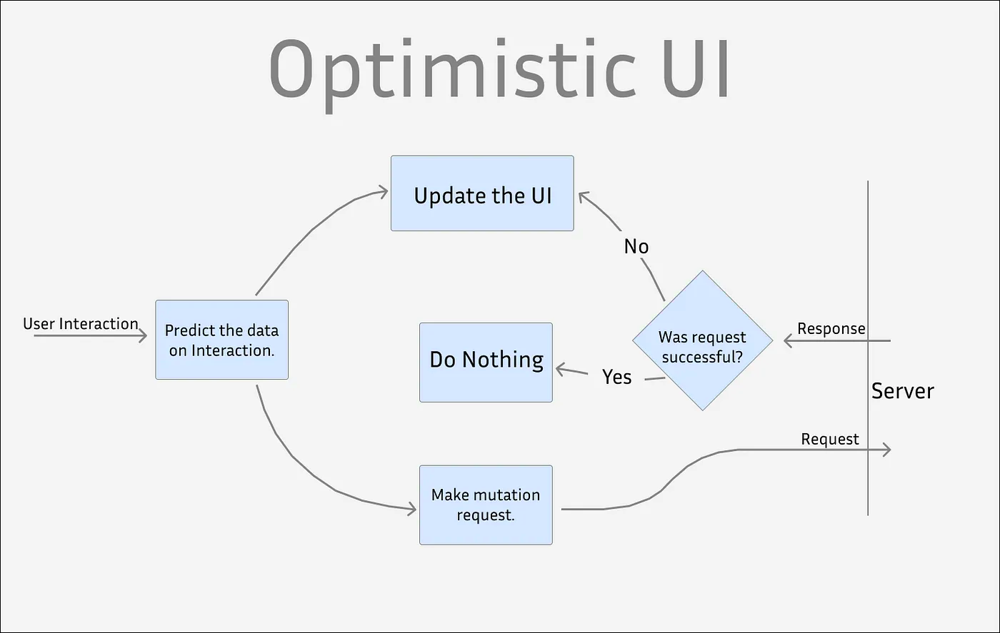

# Optimistic UI

## 1. What?
- 사용자 경험(UX)을 향상시키기 위해 디자인된 패턴(전략)
- 로딩 UI를 제거하고 사용자의 행동에 즉각적인 반응을 제공한다

## 2. How?
- 서버 응답을 기다리지 않고 예상 데이터로 UI를 먼저 업데이트함으로써 사용자 경험을 최적화

 

## 3. Benefits & Drawbacks
데이터 일관성을 유지하고 사용자 혼란을 방지하기 위한 신중한 계획과 오류 처리 메커니즘의 강화가 필요하다. 
이로써 사용자 경험을 향상시키고 복잡한 상황에서도 원활한 인터페이스와 상호 작용을 제공할 수 있다.

### 3-1. 장점
- 향상된 사용자 경험(Improved User Experience)
- 지연 시간 인식 감소(Reduced Perceived Latency)
- 참여도 증가(Engagement)
- 오프라인 및 낮은 연결성 지원(Offline and Low Connectivity Support)
- 방해가 되는 경고 감소(Fewer Interruptive Alert)
### 3-2. 단점
- 데이터 일관성 관리(Data Consistency)
- 오류 처리 복잡성 증가(Error Handling Complexity)
- 사용자 혼란 가능성(User Confusion)
- 복잡한 동기화 논리(Complex Synchronization Logic)
- 네트워크 및 서버 신뢰성(Network and Server Reliability)
- 보안 문제 가능성(Security Concerns)

## 4. reference
- https://javascript.plainenglish.io/what-is-optimistic-ui-656b9d6e187c