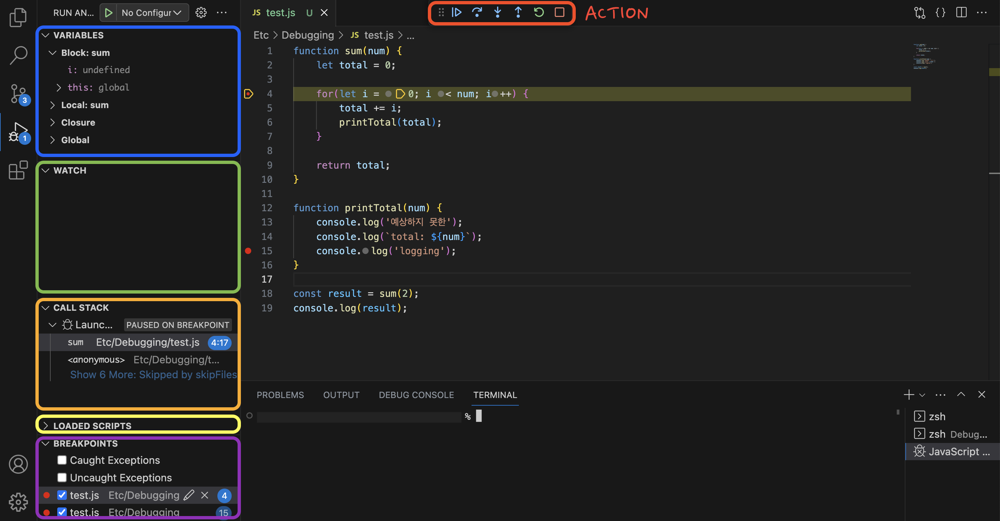
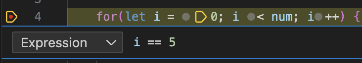

# 디버깅 파헤치기

  

## 1. 디버깅이란?
- 버그나 오류를 찾아 수정하는 과정
- 현재 상황과 예상 상황 간의 차이를 줄여나가는 방법

### ⭐️ 문제 정의(Defining the problem)
- 프로그램에서 발생한 문제나 버그를 정확하게 파악해야한다

 

## 2. 디버거툴 구성
### 2-1. 메뉴
 
|메뉴     |역할                   |
|--------|----------------------|
|`VARIABLES`|변수 값 확인 가능. 지역, 전역변수로 분리되어있다 (더블클릭하여 변수값 수정 가능)|
|`WATCH`|확인하고 싶은 변수 혹은 코드를 추가하여 값을 확인할 수 있다 (+ 아이콘 선택해서 추가)|
|`CALL STACK`|함수가 어떤 순서로 실행되는지 확인 가능|
|`LOADED SCRIPTS`|함께 로딩 된 모든 스크립트에 대해 확인 가능|
|`BREAKPOINTS`|선택한 BreakPoint 확인 및 활성화/비활성화 가능|

 

### 2-2. 액션
 
|액션         |역할                                               |
|------------|--------------------------------------------------|
|`continue`    |다음 BreakPoint로 실행|
|`step over `  |현 지점에서 한줄씩 실행(함수 실행 시, 함수 안의 동작을 확인하지 않음)|
|`step into`   |정의한 함수 안의 동작 실행|
|`step out`    |함수 바깥으로 이동|
|`restart`     |재시작|
|`stop`        |디버거 중지|

 

## 3. 유용한 디버거 사용법
### Edit break point 활용하기

- BreakPoint 우클릭 > Edit break point
- 특정 조건을 만족할 때만 BreakPoint를 실행할 수 있다