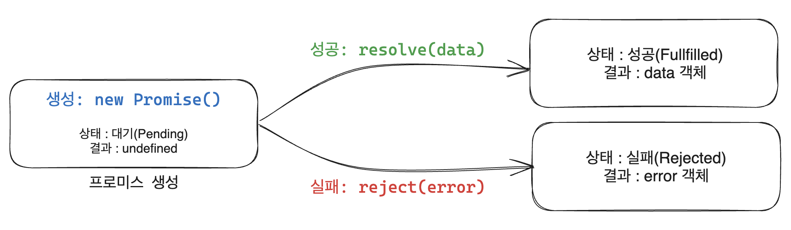

# Promise

<br/><br/>

## 0. 실전에서 Promise의 필요성
프로미스는 주로 서버에서 받아온 데이터를 화면에 표시할 때 사용한다.<br/>
일반적인 웹 애플리케이션에서 아래와 같은 API를 사용하여 서버에 데이터를 요청하고 받아온다.

```javascript
$.get(`url/goods/${id}`, function(response) {
  // ...
});
```

이때, 데이터를 받아오기도 전에 마치 데이터를 다 받아온 것 마냥 화면에 데이터를 표시하려고 하면 오류가 발생하거나 빈 화면이 뜬다.

이렇게 작업을 순차적으로 실행해야 할 때가 있다. 이러한 비동기 작업을 순차적으로 실행하기위해 `콜백 함수`를 사용한다. `콜백 함수`는 특정 로직이 끝나면 원하는 코드를 실행할 수 있게 해주기 때문이다.

그러나 콜백 함수를 반복 호출하다 보면 코드가 복잡해지고 오류 처리가 어려워지는 문제가 발생한다. 이러한 문제를 해결하기 위해 JavaScript에서는 `Promise`를 사용한다.

<br/>

## 1. Promise?
`Promise`는 자바크스립트 비동기 작업을 처리하기 위한 객체로, 최종 성공 또는 실패와 같은 결과를 처리하기 위한 구조화된 접근 방식을 제공한다.

### 비동기 처리
특정 코드의 실행이 완료될 때까지 기다리지 않고 다음 코드를 먼저 수행하는 자바스크립트의 특성.<br/>
웹 개발에서 서버에서 데이터를 불러올 시간 동안 다른 코드를 실행하지 않고 가만히 기다리면 웹사이트를 로딩하는데 시간이 굉장히 오래걸리기 때문에, 웹사이트 개발에서 비동기 작업을 자주 사용한다.

### 특징
콜백을 직접 호출하는 방법 대신, `Promise`로 콜백을 부를 수 있다는 특징 때문에 `Promise`를 사용하면 비동기 처리 시점, 비동기 함수의 결과를 쉽게 확인할 수 있고 에러도 어디서 일어났는지 파악하기 편리하다.

<br/>

## 2. 생성
`new Promise()` 메서드를 호출할 때 콜백 함수를 선언할 수 있고, 콜백 함수의 인자는 `resolve, reject` 이다.

```javascript
// 비동기 작업을 수행하는 함수를 프로미스로 감싸기
function fetchGoodsData() {
	// ...
	return new Promise((resolve, reject) {    // Pending 상태
		if(isSuccess) {
			resolve(data)                         // 성공 상태
		}
		else {
			reject(error)                         // 실패 상태
		}
	})
}
```

`fetchGoodsData()`는 `Promise`를 리턴하는 메서드이다. 요청의 결과에 따라 성공 또는 실패 상태의 `Promise`가 반환된다. 요청하기 전에는 `Promise`가 `대기(Pending)` 상태이다. <br/>

요청에 성공하면, `Promise` 생성 함수에 있는 `resolve()` 메서드가 호출된다. `Promise`가 성공 상태로 바뀌고 data 값을 가지게 된다. 성공 상태를 가진 `Promise`는 `fulfilled` 상태라고 말한다.<br/>
    
하지만 요청에 실패하면 `reject()`를 호출해서 `Promise`를 실패 상태로 바꾸고 `error` 데이터를 가지게 된다. 실패 상태를 가진 `Promise`는 `rejected` 상태라고 말한다.<br/>

<br/>

### 상태(프로미스의 처리 과정)
`new Promise()`로 프로미스를 생성하고 종료될 때까지 세 개의 상태를 갖는다.



|상태|설명|
|------|---|
|대기(`Pending`)|비동기 처리 로직을 아직 시작하지 않은 상태|
|성공(`Fulfilled`)|비동기 처리가 성공적으로 완료되어 프로미스가 결과 값을 반환해준 상태|
|실패(`Rejected`)|비동기 처리가 실패하거나 오류가 발생한 상태|

<br/>

## 3. 처리
`Promise`를 처리할 때는 `then()` 또는 `catch()` 메서드를 사용할 수 있다. <br/>
아래는 `Promise`를 처리하기 위해 `then()`과 `catch()`를 연결해놓은 일반적인 코드의 모습이다.

```javascript
fetchGoodsData({
  orderId: "order0001",                           
})
    .then(function (data) {     // 성공 시
        console.log(data);  
    })
    .catch(function (error) {   // 실패 시
        if (error.code == "INVALID_ID") {
            console.log(error.message);
        }
    });
```

요청에 결과로 성공 상태의 `Promise`가 반환되면 `then()` 메서드가 호출된다. 이를 이용하여 처리 결과 값을 받을 수 있다. <br/>

반대로 실패 상태의 `Promise`가 반환되면 then() 메서드를 건너뛰고 `catch()` 메서드가 바로 호출된다. 실패 처리의 결과 값을 받을 수 있다. `catch()` 블록에서는 각 에러 코드를 처리하는 로직을 추가하면 좋다.

<br/>

## 4. 프로미스 체이닝
여러 개의 프로미스를 `.then()`으로 연결하여 처리할 수 있다. `then()`메서드를 호출하고 나면 새로운 프로미스 객체가 반환되기 때문에, 아래와 같은 형식으로 코딩이 가능하다.

```javascript
function getData() {
  return new Promise({
    // ...
  });
}

getData()
  .then(function(data) {
    // ...
  })
  .then(function() {
    // ...
  })
  .then(function() {
    // ...
  });
```

<br/>

### 실무 사례 살펴보기 - 사용자 로그인 인증 로직
페이지에 입력된 사용자 정보를 받아와 파싱, 인증 등의 작업을 거치는 코드에 프로미스 체이닝을 적용한 사례이다.

```javascript
var userInfo = {
  id: 'test@abc.com',
  pw: '****'
};

function getData() {
  return new Promise({
    // ...
  });
}
function parseValue() {
  return new Promise({
    // ...
  });
}
function auth() {
  return new Promise({
    // ...
  });
}
function display() {
  return new Promise({
    // ...
  });
}

getData(userInfo)   //사용자 정보 받아오기
  .then(parseValue) //파싱
  .then(auth)       //인증
  .then(diaplay);   //작업
```

<br/>

## 5. Reference
- 🔗 [reference_01](https://developer.mozilla.org/ko/docs/Web/JavaScript/Reference/Global_Objects/Promise)
- 🔗 [reference_02](https://joshua1988.github.io/web-development/javascript/javascript-asynchronous-operation/)
- 🔗 [reference_03](https://joshua1988.github.io/web-development/javascript/promise-for-beginners/)
- 🔗 [reference_04](https://blog.tossbusiness.com/articles/dev-8)