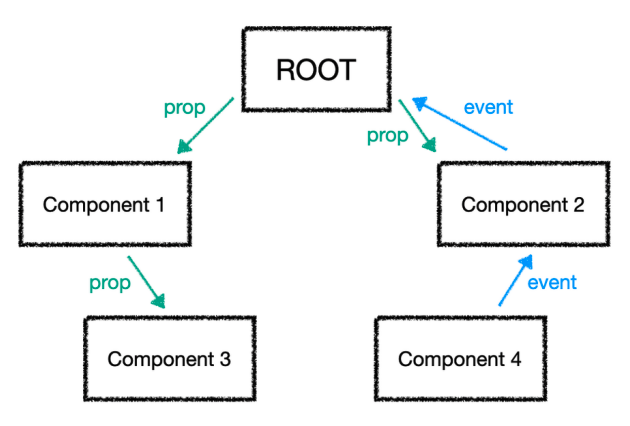
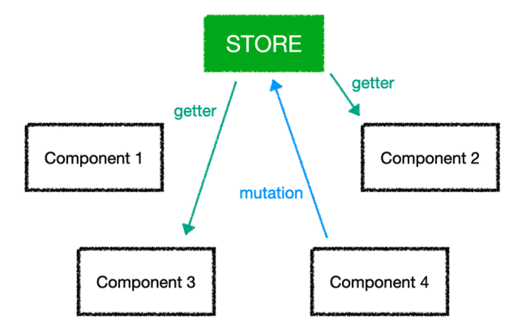

# Pinia
모듈식 및 Composition API 중심 접근 방식을 따르는 Vue3용 상태 관리 솔루션<br/>
논리적 관점에서 개발 가능

<br/><br/>

## 0. 상태관리 라이브러리의 필요성


Vue.js에서 하나의 화면은 수많은 컴포넌트로 구성되어 있어서 부모 컴포넌트와 자식 컴포넌트 간에 관계가 존재한다.
부모-자식 컴포넌트 관계가 깊어지면 부모 컴포넌트의 상태를 자식 컴포넌트로 전달하기 위해 계속해서 인자를 전달해야 하는 번거로운 코드가 반복될 수 있다.<br/>


Vue.js에서는 이러한 문제를 해결하기 위해 Vuex와 Pinia와 같은 상태 관리 라이브러리가 등장했다. 이러한 라이브러리는 모든 컴포넌트에서 `중앙 집중식 저장소` 역할을 수행한다.<br/>

<br/>

## 1. 스토어 만들기
Pinia에서는 스토어를 생성하여 애플리케이션의 상태를 관리한다<br/>
스토어란 state, getters, actions을 포함하는 모듈식 단위<br/>
Pinia에서는 동기/비동기적 로직 모두 action에서 수행할 수 있기 때문에, mutations이 없다

### 설치
```bash
npm install pinia
# or
yarn add pinia
```
<br/>

### Option Stores(options API)
```javascript
import { defineStore } from 'pinia';

// 반환된 함수의 이름을 use... 로 지정하는 것을 권장
// defineStore의 첫번째 argument는 devtools에서 connect할 수 있는 unique ID
export const useOptionStore = defineStore('optionStore', {
    state: () => ({ 
        count: 0, 
        name: 'Pinia' 
    }),
    getters: {
        getDoubleCount: (state) => state.count * 2,
    },
    actions: {
        increment() {
            this.count++
        },
    },
})
```
<br/>

### Setup Stores(composition API)
setup()과 유사하게 반응형 속성과 메서드를 정의하는 함수를 정의하고, 노출하려는 속성과 메서드가 포함된 객체를 반환한다

```javascript
const { defineStore } = Pinia;
const { computed, ref } = Vue;

export const useCompositionStore = defineStore('compositionStore', () => {
    
    // ref() → state
    const count = ref(0);
    const name = ref('Pinia');

    // computed() → getters
    const getDoubleCount = computed(() => count.value * 2);

    // function() → actions
    function increment() {
        count.value++;
    }

    return { count, name, getDoubleCount, increment }
})
```

<br/><br/>

## 2. 스토어 사용
컴포넌트의 템플릿 또는 스크립트 섹션에서 직접 스토어 상태 속성에 액세스하고 작업을 호출할 수 있다

### 스토어 연결
```javascript
const { createPinia } = Pinia;
const app = createApp({ /* root component */});

//use를 통해 app에 pinia를 연결
app.use(createPinia());
```

<br/>

### 스토어 사용
스토어에 정의된 state, getters, actions를 직접 사용 가능<br/>

```javascript
import { useCompositionStore } from '@/stores/store';

export default {
  setup() {
    const store = useCompositionStore();

    // Access state : myStore.propertyName
    const countNum = store.count;

    // Call actions : myStore.actionName()
    const incrementCount = () => store.increment();

    return { store, countNum, incrementCount };
  },
};
```

<br/>

### 스토어의 반응성 유지하기

#### 반응성이 사라진 경우
```javascript
import { useCompositionStore } from '@/stores/store';

export default {
  setup() {
    const store = useCompositionStore();
    const { count, name, getDoubleCount, increment } = store;

    return { count, name, increment , getDoubleCount };
  },
};
```
```html
<template>
  <div class="check">
    {{ name }} : {{ getDoubleCount }}
    <!-- increment 함수를 실행하면, store에 정의된 count값은 올라가지만 반응성이 사라진 것을 확인할 수 있다 -->
    <button @click="increment">increment</button>
  </div>
</template>
```

<br/>

#### `storeToRefs()`으로 반응성 유지하기
state이나 getter는 구조 분해 할당시 `storeToRefs()`를 사용하여 반응성을 유지
```javascript
import { useCompositionStore } from '@/stores/store';
import { storeToRefs } from 'pinia';

export default {
  setup() {
    const store = useCompositionStore();

    const { increment } = store;
    const { count, name, getDoubleCount } = storeToRefs(store);

    return { count, name, getDoubleCount, increment };
  },
};
```

<br/>

## 3. Multiple store
Pinia는 여러개의 스토어를 생성할 수 있다<br/>
유사한 성격의 요소들을 독립된 store에서 관리
### 스토어 조합
서로를 사용하는 스토어
```javascript
const useX = defineStore('x', () => {
  const y = useY();

  // ❌ 스토어 설정(setup) 함수에서 서로의 상태(state)를 직접 읽어올 수 없다
  // y.name

  function doSomething() {
    // ✅ getter나 action내 에서 y 속성을 읽을 수 있다
    const yName = y.name
  }

  return {
    name: ref('X입니다'),
  }
})
```

<br/>

### 중첩 스토어
한 스토어가 다른 스토어를 사용하는 경우, getter or action내에서 useStore() 함수를 직접 호출하고 사용

#### 공유 게터(Shared Getters)
```javascript
import { defineStore } from 'pinia'
import { useUserStore } from './user'

export const useCartStore = defineStore('cart', {
  getters: {
    summary(state) {
      const user = useUserStore();

      return `${user.name}님, 장바구니에 ${state.list.length}개의 아이템이 있습니다`;
    },
  },
})
```

#### 공유 액션(Shared Actions)
```javascript
import { defineStore } from 'pinia'
import { useUserStore } from './user'

export const useCartStore = defineStore('cart', {
  actions: {
    async orderCart() {
      const user = useUserStore();

      try {
        await apiOrderCart(user.token, this.items);
        this.emptyCart();
      } catch (err) {
        displayError(err);
      }
    },
  },
})
```