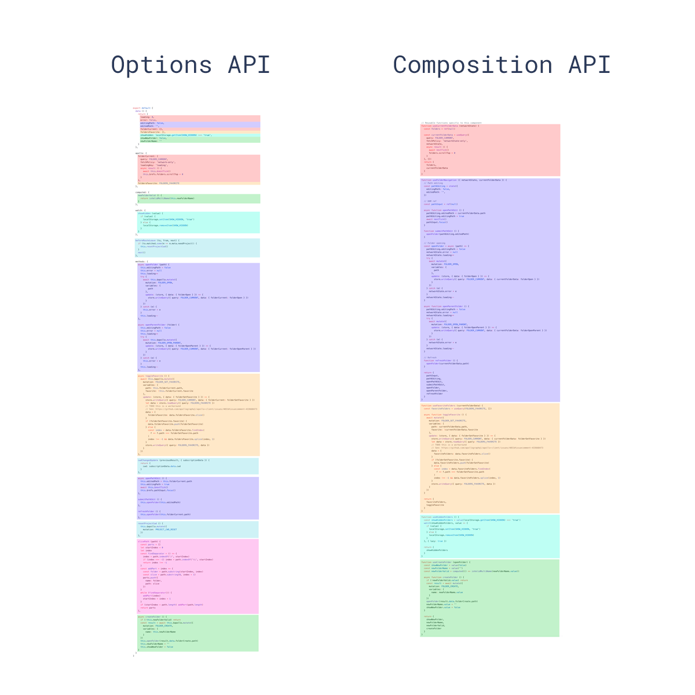

# composition API

<br/><br/>

## composition API
옵션을 선언하는 대신 가져온 함수를 사용하여 Vue 구성 요소를 작성할 수 있는 API Style<br/>
setup 함수를 사용하여 컴포넌트의 상태 및 메서드를 정의한다<br/>
setup 함수는 컴포넌트가 생성되고 초기화될 때 실행되며, return으로 반환하여 템플릿에서 사용할 수 있다<br/>
```javascript
import { ref, onMounted } from 'vue';
 
export default {
  setup() {
    const count = ref(0);
 
    const increaseCount = () => {
      count.value++;
    };
 
    onMounted(() => {
      console.log('Mounted: ', count.value);
    });
 
    // 템플릿에서 접근 가능한 값과 메서드를 선별할 수 있다
    return {
      count,
      increaseCount
    };
  }
};
```
```html
<template>
  <div>
    <button @click="increaseCount">Increase Count</button>
    <p>Count: {{ count }}</p>
  </div>
</template>
```

<br/>

### Reactivity API(ref vs reactive)
데이터를 ref()나 reactive() 메서드로 감싸 반응성을 부여한다<br/>
컴포넌트의 setup() 함수 내에서 선언하고 반환하면 템플릿에서 엑세스 가능

#### ref()
- ref()는 인수를 가져와서 .value 속성이 있는 ref 객체에 래핑하여 반환
- 타입제한 : String, Number, Object 등 모든 원시 타입에서 사용 가능

    ```javascript
    import { ref } from 'vue';

    export default {
        setup() {
            const count = ref(0); //{ value: 0 }

            function increment() {
                count.value++;
            }

            return {
                count,
                increment
            }
        }
    }
    ```
<br/>

#### reactive()
- reactive()는 인수로 받은 객체 자체를 반응형으로 만든다
- 타입 제한 : Object, array, Map, Set과 같은 객체, 배열 및 컬렉션 타입에만 작동
- 반환 값은 원본 객체를 재정의한 Proxy
- Proxy만 반응형이기 때문에, 객체를 Vue의 반응형 시스템으로 작업할 때 상태를 재정의한 Proxy만 사용하자

    ```javascript
    const raw = {}
    const proxy = reactive(raw)
    console.log(proxy === raw) // false
    ```
    ```javascript
    import { reactive } from "vue";

    export default {
        setup() {
            const name = reactive({
                id: 1,
            });

            const updateName = () => {
                name.id = 2;
            };
            return {
                name,
                updateName,
            };
        },
    };
    ```

<br/>

### props 받기
setup의 인자로 전달한 다음 내부에서 활용
```javascript
export default {
  props: {
    posts: { type: Object, required: true },
  },
  setup(props) {
    console.log(props.posts);
  }
};
```

<br/><br/>

## 2. options API와 비교
### options API
data 객체를 사용하여 컴포넌트의 상태(변수)를 정의하고, methods 객체에 메서드를 작성한다<br/>
data 객체의 변수들은 Vue 인스턴스 내부에서 this를 통해 접근할 수 있다
```javascript
export default {
  data() {
    return {
      count: 0
    };
  },
  mounted() {
    console.log('Mounted: ', this.count);
  },
  methods: {
    increaseCount() {
      this.count++;
    }
  }
};
```
<br/>

### LifeCycle 메서드 변화
|(Vue2) option API|(Vue3) composition API|
|------|---|
|beforeCreate()|setup() 대체|
|created()|setup() 대체|
|beforeMount()|onBeforeMount()|
|mounted()|onMounsted()|
|beforeUpdate()|onBeforeUpdate()|
|updated()|onUpdated()|
|beforeDestroy()|onBeforeUnmount()|
|destroyed()|onUnmounted()|
|errorCaptured|onErrorCaptured()|

<br/>

### 코드 구성
|API Style|설명|
|------|---|
|`options API`|data, methods, computed, watch, mounted 등 데이터의 변화에 관련된 로직이 각각 흩어져 있다<br/> 컴포넌트 내 로직이 커질수록 데이터의 흐름을 단번에 이해하기 어려움|
|`composition API`|setup() 메서드 안에서 논리점 관점에서 로직을 그룹핑한다<br/>데이터의 흐름을 쉽게 파악할 수 있고, 유지보수 용이해짐|

 